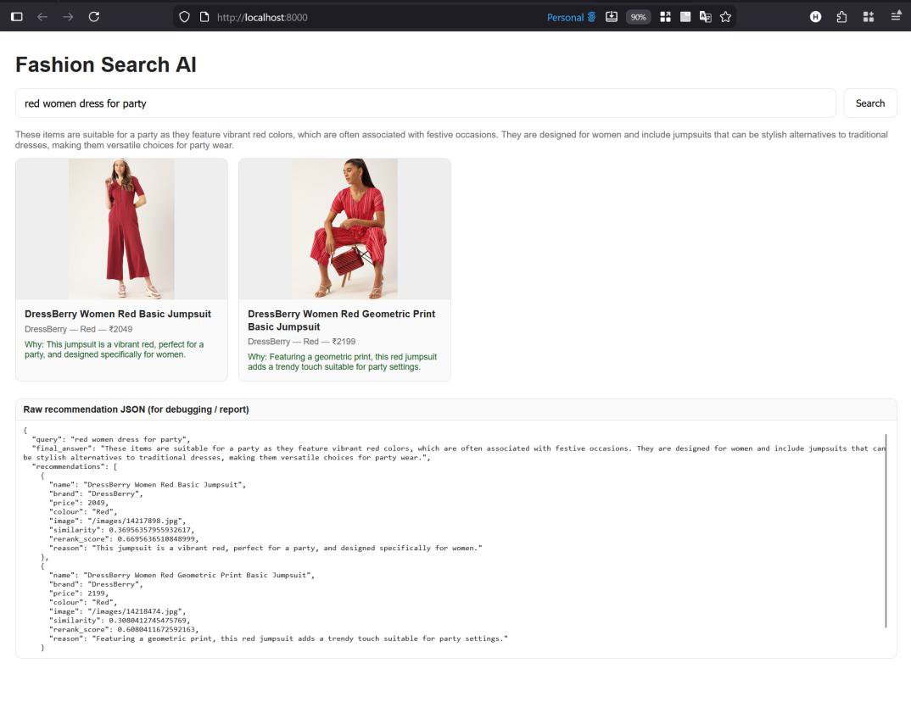
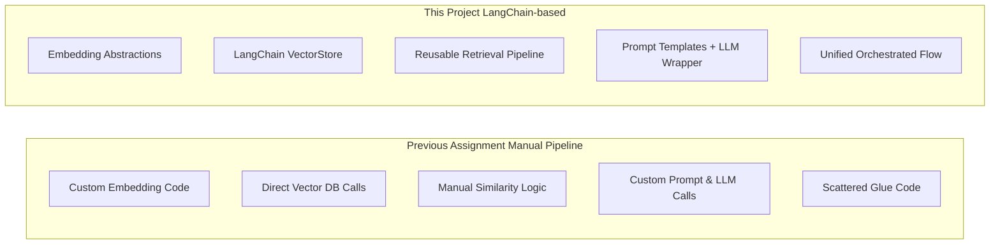

# Fashion Search AI  
### Semantic Spotter Project (LangChain-based Generative Recommendation System)

---

## Overview

Fashion Search AI is an end-to-end semantic search and generative recommendation system built using LangChain.  
It allows users to search a fashion product catalog using natural-language queries and receive relevant product recommendations with clear explanations.

Unlike traditional keyword-based search, this system focuses on semantic understanding, enabling it to identify products based on meaning, intent, and context rather than exact word matches.

This project is developed as part of the Semantic Spotter Project, with a strong emphasis on using modern LLM frameworks such as LangChain to build scalable, maintainable, and explainable AI systems.

---

## Problem Statement

Fashion e-commerce platforms often contain thousands of products, making it difficult for users to locate relevant items using short or imprecise queries (for example, \"red dress for party\"). Keyword-based search struggles with synonyms, paraphrases, and implicit intent.

The objective of this project is to build a semantic spotter system that:
- Understands user intent from natural-language queries
- Retrieves semantically relevant fashion products
- Generates concise, human-readable explanations for recommendations

---

## Why LangChain?

LangChain is a core component of this project and serves as the main orchestration framework.

Key advantages of using LangChain include:
- High-level abstractions for embeddings, vector stores, and LLMs
- Seamless integration with ChromaDB for semantic retrieval
- LLM-agnostic design, allowing easy model replacement
- Reduced boilerplate and glue code compared to manual orchestration
- Improved maintainability and extensibility

---

## Evolution from Previous Assignment



LangChain significantly reduces system complexity while preserving full control over retrieval and generation logic.

## Dataset

Source: Myntra Fashion Dataset (Kaggle)

The dataset contains product-level information such as name, brand, color, price, description, and product identifiers. Image assets are mapped using standardized filenames based on product IDs.

Preprocessing steps included:

- Removal of malformed or incomplete records
- Normalization of textual fields
- Alignment of images with product metadata

## Overall System Design


This architecture places LangChain at the center of the system, orchestrating embedding generation, semantic retrieval, and natural-language explanation.

## Semantic Spotter Workflow


The workflow demonstrates how semantic meaning is captured from user queries and transformed into relevant, explainable fashion recommendations.

### System Components

Backend Components:

- FastAPI for API exposure

- LangChain for orchestration and abstraction

- ChromaDB for persistent vector storage

- Sentence-Transformers (all-MiniLM-L6-v2) for embeddings

Recommendation Logic:

- Semantic similarity search using LangChain vector stores

- Lightweight hybrid reranking using domain-aware signals

- Top-3 recommendations selected for clarity and evaluation

Generation:

- LangChain LLM wrappers when API keys are available

- Rule-based fallback generation for offline or local execution

- Structured JSON output with explicit relevance explanations

User Interface

The user interface is implemented using HTML, CSS, and JavaScript and communicates with the backend through a single recommendation endpoint.

The UI displays:

- Product image

- Product name, brand, color, and price

- A short explanation describing why the product was recommended

- A loading indicator is displayed during search execution, and raw JSON responses are available for inspection.

Project Structure
```
FashionAI/
├── app/
│   ├── main.py
│   ├── routers/
│   │   └── recommend.py
│   ├── services/
│   │   ├── langchain_pipeline.py
│   │   ├── reranker.py
│   │   └── generation.py
│   └── utils/
│       ├── settings.py
│       └── logger.py
├── scripts/
│   └── build_db.py
├── vector_store/
│   └── chroma/
├── ui/
│   └── index.html
├── prompts/
│   └── prompt_generation.txt
├── README.md
└── requirements.txt
```

## Author
Vo Duc Huy