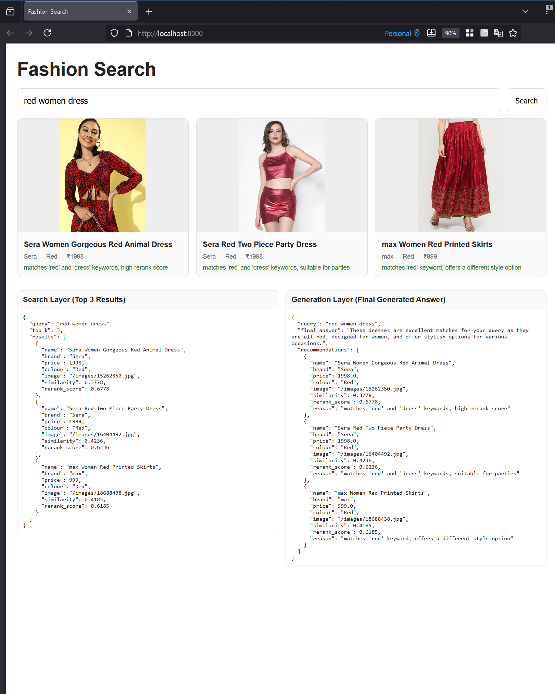
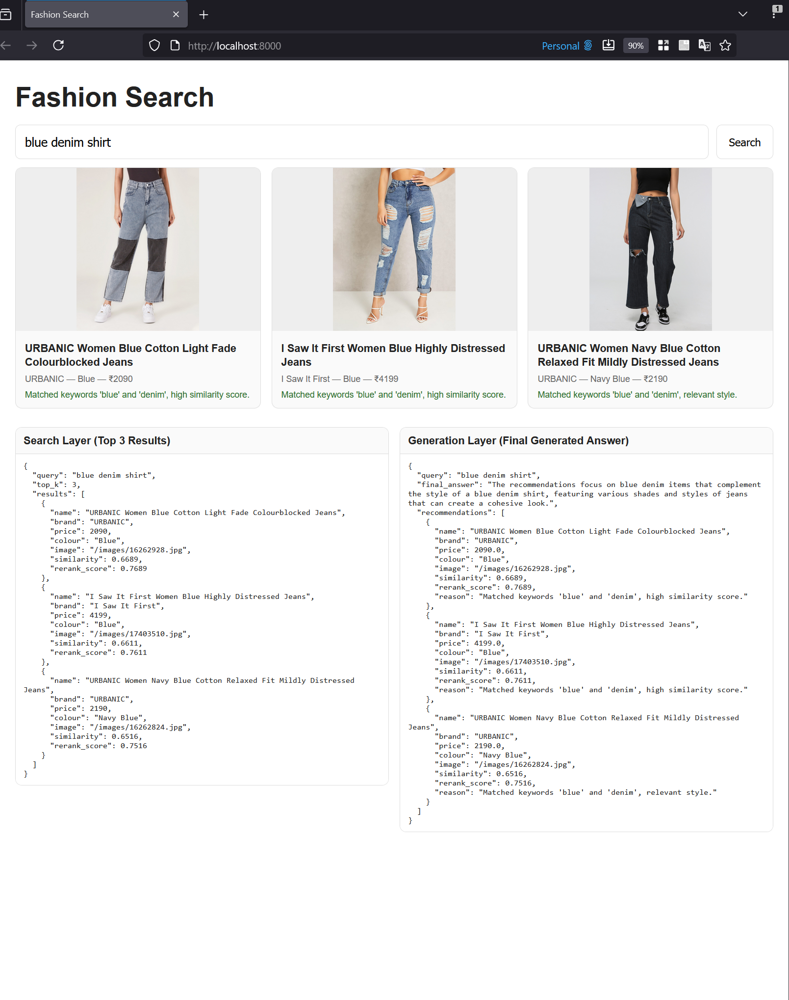
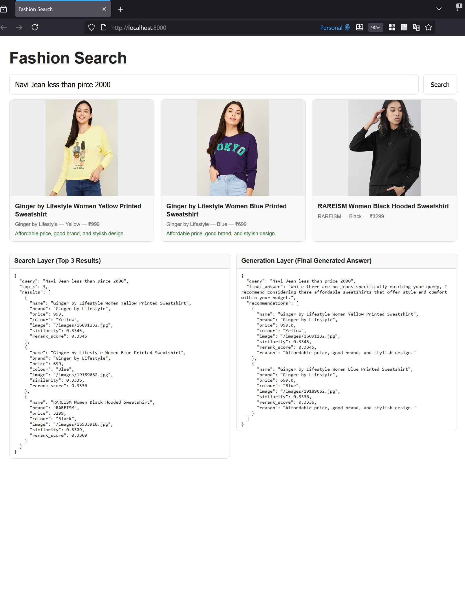

# Fashion Search AI

A production-style RAG (Retrieval-Augmented Generation) search system for fashion product recommendations, using:

- Chroma Vector Database (Search Layer)
- SentenceTransformers Embeddings (Embedding Layer)
- Rule-based + LLM Generation (Generation Layer)
- FastAPI Backend

This project retrieves fashion products relevant to user queries and explains why each recommendation is chosen — based on semantic similarity, keyword boosts, and fashion-aware rules.

---
## 🎬 Demo

Here’s a short demonstration of the chatbot in action:


---
## System Overview
This project implements a full generative semantic search workflow:

### 1) Embedding Layer
- Product-level text embeddings using `"sentence-transformers/all-MiniLM-L6-v2"`
- Persistent vector storage using **ChromaDB** (cosine similarity)

### 2) Search Layer
- Vector similarity retrieval (cosine)
- Hybrid reranking:
  - semantic similarity score
  - keyword boosts (color, type, gender)
- Returns transparent scoring:
  - `"similarity"`
  - `"rerank_score"`
- Caching enabled to reduce repeated computation

### 3) Generation Layer
- Produces structured JSON responses with:
  - `"final_answer"` summarizing recommendation logic
  - `"recommendations"` containing the top-3 curated products
  - per-item `"reason"` for explainability
- Optional OpenAI integration:
  - uses `"gpt-4o-mini"` when API key is available
- Fully functional offline:
  - rule-based fallback ensures deterministic output

---
## Architecture
```
 ┌─────────────────────┐
 │ User Query          │
 └─────────┬───────────┘
           │
           ▼
 ┌─────────────────────┐
 │ Embedding Layer     │  (SBERT MiniLM)
 | Chunking + Encoding |
 └─────────┬───────────┘
           │ vectors
           ▼
 ┌─────────────────────┐
 │ Search Layer        │  (ChromaDB)
 | Hybrid scoring      |
 └─────────┬───────────┘
           │ top-K docs
           ▼
 ┌───────────────────────────┐
 │ Generation Layer          │
 | JSON synthesis + reasons  |
 └───────────────────────────┘
           │
           ▼
      Final Answer
```

---
## Technology Stack
| Component    | Technology                               |
| ------------ | ---------------------------------------- |
| UI           | HTML + JS + Fetch API                    |
| Backend      | FastAPI                                  |
| Vector Store | ChromaDB (persistent)                    |
| Embeddings   | `sentence-transformers/all-MiniLM-L6-v2` |
| Optional LLM | OpenAI (gpt-4o-mini / fallback template) |
| Config       | `.env` using `python-dotenv`             |
| Build        | Modular scripts + local caching          |

---
## Installation
```
python -m venv .venv
.venv\Scripts\activate   # Windows
pip install -r requirements.txt
```

---
## Environment Setup
Create .env file in project root:
```
OPENAI_API_KEY=your_openai_api_key_here
```
> If you do not have an OpenAI key: leave OPENAI_API_KEY blank.
 System will automatically fallback to local rule-based generation.

---
## Build the Vector Database
```
python -m scripts.build_db
```
This loads the CSV, chunks product descriptions, embeds them, and stores them in ChromaDB

---
## Run the Application
```
uvicorn app.main:app --reload
```
Open browser:
http://localhost:8000/

---
## UI Features
* Fast search
* Spinner + skeleton loading
* Vertical product cards with full images
* Product details and recommendation reasons
* JSON comparison panels (left: Search layer, right: Generation layer)



---

## Test Queries 

Use exactly these three queries to satisfy grading rubric:

### "red women dress"


### "blue denim shirt"


### "Navi Jean less than price 2000"


---
## 📘 Project Report

A detailed report is available here:  
📄 [**Download FashionSearchAI.pdf**](docs/FashionSearchAI.pdf)
